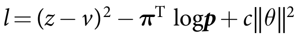

# Training a Neural Network to play Checkers with Monte Carlo Tree Search


## Overview
I trained a neural network to play Checkers through self-play using Monte Carlo Tree Search.  The agent achieves **TBD** after **TBD** training iterations.  This required about **TBD** days of training on a laptop with an Intel Core i7-6820HQ CPU @ 2.70GHz and an NVIDIA Quadro M2002M GPU (CUDA Compute Capability 5.0).

I wrote the code in Python 3.7 and used Keras 2.4.3 (GPU-enabled with Tensorflow backend), Pygame 1.9.6[\*](#footnotes), and Matplotlib 3.3.2.  A **requirements.txt** file is included for convenience.  

I have attempted to replicate the approach DeepMind took when creating [AlphaZero](https://deepmind.com/blog/article/alphazero-shedding-new-light-grand-games-chess-shogi-and-go), albeit with a fraction of the computational resources.  I have written several Python classes to implement the Checkers environment, the MCTS algorithm, and DeepMind's training pipeline.  The Python files of interest are:

 * **Checkers** is the agent-agnostic environment which contains all of the functions related to the game of Checkers, including a Pygame GUI. 
 * **MCTS** Contains classes to implement the Monte Carlo Tree Search algorithm for two-player turn-based games.
 * **train_Checkers** Initiates the DeepMind training pipeline of training data generation through self-play, neural network training, and network evaluation.
 * **play_Checkers** imports a saved neural network model and uses it to play a demonstration game of Checkers using the Monte Carlo Tree Search algorithm.
 * **training_pipeline** Contains classes to generate Checkers training data and to create a tournament to compare the performance of two different trained neural networks.

The following sections provide an overview of DeepMind's approach to reinforcement learning and how I adapted the techniques used in *AlphaZero* for the game of Checkers.

## DeepMind's Approach to Deep Reinforcement Learning
[I previously implemented](https://github.com/AlexMGitHub/Minesweeper-DDQN) an agent that learned to play Minesweeper based on DeepMind's work with Atari games.  DeepMind published several papers between 2013 and 2016 that used deep double Q-learning to train neural networks to play a variety of Atari games at better-than-human performance.  That's not to say *super*-human performance, but the agent often achieved a higher score than the human player used as a baseline for the game.  I found that my Minesweeper agent won 23.6% of its games on Expert difficulty.  This is a far higher win rate than what I personally could achieve as a human player, but a "perfect" player would be expected to win more than 35% of its games.  Although DeepMind's trained agents successfully learned to play many of the Atari games, in some of the games the agents performed significantly worse than the human baseline.  This earlier mixed success on Atari games was blown out of the water by the 4-1 victory of [AlphaGo against Lee Sedol](https://deepmind.com/research/case-studies/alphago-the-story-so-far) in March 2016.  


### AlphaGo, AlphaGo Zero, and AlphaZero

*AlphaGo's* [[1]](#references) defeat of an 18-time world Go champion was a major milestone in artificial intelligence.  Go is far more complex than any Atari game with more than 10 to the power of 170 possible board configurations.  Prior to *AlphaGo* and its successors, no Go program had defeated a professional Go player.  *AlphaGo Zero* [[2]](#references) was a refinement of *AlphaGo* that required no human knowledge (no training on games between human players) and became an even stronger player than *AlphaGo*.  Finally, DeepMind generalized the *AlphaGo Zero* algorithm (named *AlphaZero* [[3]](#references)) and applied it to the games of Go, Chess, and Shogi with outstanding results.  DeepMind claims that *AlphaGo* (or its successors) is the greatest Go player of all time.  

Go is a two-player game, whereas the Atari games DeepMind previously worked with were single-player games.  In a single-player game the agent interacts with a game environment and receives rewards or punishments based on those interactions.  In two-player games like Go, the agent instead plays against an opponent and receives a reward or punishment depending on the outcome of the match.  This led to DeepMind training the agent through *self-play*, that is having the agent play millions of games of Go against *itself*.  The experience gathered through these self-play games is used to train a very deep neural network.  Once trained, the neural network plays a series of games against the previous iteration of the network to see which neural network is stronger.  The better neural network then plays many thousands of games against itself to generate a new set of training data, and the entire cycle repeats itself until the agent has reached the desired level of play strength.

The graphic [[4]](#references) created by David Foster provides a great overview of the *AlphaGo Zero* algorithm.  All of the *AlphaGo* variants combine their neural network's inferences with an algorithm called Monte Carlo Tree Search.  This remarkable algorithm is key to the success of *AlphaGo* and its successors.


## Monte Carlo Tree Search

### Overview
I (and most blogs I found) referenced [[5]](#references) for a fantastic overview of the Monte Carlo Tree Search algorithm.  The algorithm creates a tree composed of nodes, each of which represents a possible move or game state.  Every node also stores statistics about the desirability of the potential move that it represents.  The root node represents the current game state, and its child nodes are the legal possible moves that can be made from that root node.  Each child node has children of its own, which are possible moves that the opponent can make.  These "grandchild" nodes have children of their own, which are moves that the original player can make after his opponent has moved, and so on.  The tree quickly grows large even for relatively simple games, and each branch eventually ends in a terminal node that represents one possible game outcome (win, loss, or draw).  The [branching factor](https://en.wikipedia.org/wiki/Game_complexity#Complexities_of_some_well-known_games) of games like Chess and Go are so large that it's not possible to represent every potential move in the tree, and so the tree search is constrained by a user-defined computational budget.

<p align="center">

</p>

Given these computational restraints, the tree search must proceed in such a way as to balance the classic trade-off between exploration and exploitation.  The above image is taken from [[5]](#references) and gives a visual overview of the four phases of the Monte Carlo Tree Search algorithm.  In each iteration of the MCTS algorithm, the *tree policy* decides which nodes to select as it descends through the tree.  Eventually, the tree policy will select a node that has children that have not yet been added to the tree (expandable node).  One of the unvisited child nodes is added to the tree, and a simulation or "rollout" is played out according to a *default policy*.  The simulation starts at the newly added node and continues until it reaches a terminal state.  Finally, the outcome of the simulation is backpropagated up the tree to the root node, and the statistics of each node along the way are updated.  This is a simple algorithm, but what makes it really effective are the two policies: the tree policy and default policy. 


### Tree Policy
The tree policy balances the exploration/exploitation trade-off.  It does this by treating the choice of child node as a multi-armed bandit problem, and uses a variant of the Upper Confidence Bound algorithm called UCT (Upper Confidence bounds applied to Trees).  As mentioned in the previous section, each node stores statistics that are updated whenever a simulation outcome is backpropagated through it.  The UCT formula is:

<p align="center">

</p>

Where:

* **q<sub>j</sub>** The total reward or Q-value of child node *j*
* **n<sub>j</sub>** The number of visits to child node *j*
* **X<sub>j</sub>** The average Q-value of child node *j* (q<sub>j</sub> / n<sub>j</sub>)
* **n** The number of visits to the parent node
* **C<sub>p</sub>** A constant of value > 0 used to tune the amount of exploration

Each node in the tree keeps track of its *q* and *n*, and the UCT score of the node may be recalculated for each iteration of the tree policy.  The node with the highest UCT score amongst its "sibling" nodes will be selected for traversal.  Nodes with higher average Q-values (X<sub>j</sub>) will have commensurately higher UCT scores to encourage exploitation.  However, this is offset by the second term that encourages exploration.  The natural log of the total number of visits to the parent node is divided by the number of visits to child node *j*.  If child node *j*'s sibling nodes have received many visits while node *j* has received relatively few, this second term will increase compared to its siblings.  The UCT score of node *j* will also increase and may eventually cause it to be selected by the tree policy.  This means that nodes with low average Q-values still get selected occasionally to ensure that they really are sub-optimal choices and not just unlucky.  Without this exploration term, a move that could be optimal but had some initial rollouts that lowered its average Q-value would never be visited again.  DeepMind used a modified version of UCT for *AlphaZero* that will be discussed in a later section.


### Default Policy

As the tree policy descends down the tree it will eventually encounter an expandable node.  An expandable node is a node that has unvisited child nodes that have not yet been added to the tree.  The tree policy adds one of the unvisited child nodes to the tree, and then performs a simulation from that new node according to the default policy.  The default policy for standard MCTS is to simulate the remainder of the game by simply choosing random moves for both players until the game reaches a terminal state.  The reward based on the simulated outcome of the game is then backpropagated through the tree starting with the new node and ending with the root node.  Each node in the selected path has its *n* value incremented by one, and its *q* value increased by +1, 0, or -1 for a win, draw, or loss, respectively.  The next iteration of the tree policy uses these updated statistics to calculate the nodes' UCT scores.

Simulating the game's outcome by randomly choosing actions may at first seem like a poor way to estimate the value of a potential move.  In effect, this default policy estimates the probability of winning from a given state by randomly sampling the possible outcomes from that state.  If enough random rollouts are performed then by the law of large numbers the resulting average Q-value of the node should approach the expected value of the probability distribution.  Stronger moves will have a larger expected value (higher chance of winning), and weaker moves will have a smaller expected value (lower chance of winning).  These random rollouts have apparently been used with a degree of success even in fairly complex games like Chess.  For games like Checkers with small branching factors a modest number of rollouts can result in a decent level of play.  For games like Go with enormous branching factors random rollouts will be far less effective.  

*AlphaZero* completely removed random rollouts and replaced them with so-called "truncated rollouts."  When the tree policy reaches an expandable node, the default policy inputs the node's state to the neural network and the resulting estimated Q-value is backpropagated.  More details will be presented in a later section.      

### Choosing the Best Child
The tree search ends once the computational budget is exhausted.  The root node's children will now have statistics associated with them that can be used to determine the best next move.  This "best child" can be chosen according to several different criteria according to [[5]](#references):

1. Node with the highest reward (Max child)
2. Node with the most visits (Robust child)
3. The node with the highest visit count and highest reward (Max-Robust child)
4. The child which maximizes a lower confidence bound (Secure child)

According to [[5]](#references) the robust child method is the most commonly used criterion.  Once a player has selected its move, the resulting state becomes the root node of the opposing player's tree search.  All of the nodes representing the possible moves that the first player *didn't* make are discarded (or pruned) from the second player's tree.  Only the nodes representing the first player's chosen move (and any child nodes) are preserved.  The statistics of these preserved nodes will be used in the second player's new tree search.


### MCTS Implementation
A critical "gotcha" that is not well-explained in [[5]](#references) is how to determine a node's reward based on the outcome of the game.  Some of the nodes in the tree represent player 1's potential moves, and the other node's represent player 2's possible moves.  If player 1 wins the game in the simulation, nodes representing its potential moves should receive a reward of +1.  Player 2 then lost the simulated game and should receive a reward of -1 to all nodes representing its potential moves.  

This seems straightforward, and yet when I ran my Tic-Tac-Toe game environment to test my MCTS implementation both players made nonsensical moves.  Rather than attempting to win (or prevent the other player from winning) both players seemed to choose the *worst* possible move in every situation!  It took some time to understand the mistake that I had made.  Originally, if player 1 won the game I awarded +1 to all nodes with player 1 as the current player, and all nodes with player 2 as the current player a -1.  I eventually realized that this is exactly backwards:

If the player of the current state is player 1, that means that the current node is a child node (potential move) of player 2.  Therefore the rewards are flipped: a player 1 victory on a player 1 node receives a reward of -1.  A player 2 victory on a player 1 node receives a reward of +1.  This adjusts the UCT value of the node from the opponent's perspective, and incentivizes the MCTS to choose nodes that favor player 2 when representing it during the selection phase.  The same is true for player 2 nodes so that they are chosen from player 1's perspective during the selection process.

After making this change, the Tic-Tac-Toe agents played optimally and every game ended in a draw.  However, there was one further wrinkle when implementing MCTS for the game of Checkers.  In the event of a multi-jump (double-jump, triple-jump, etc.) the player is required to make more than one move per turn.  This means that either player could make two or more moves in a row.  To handle this scenario I explicitly check the parent node's player and compare it to the outcome of the simulation.  If player 1 wins the simulation and the current node's parent node is also player 1 then the reward is +1.  Otherwise, the reward is -1.  

One final headache was implementing the MCTS reward for a neural network's "truncated rollout" rather than a random rollout.  A truncated rollout is named such because it does not simulate the outcome of the game.  Instead, the neural network outputs a Q-value estimate for the node's state, and that value is backpropagated through the tree.  Because the state representation of the board does not contain information about previous moves (see relevant section below), the neural network doesn't know who the previous player was when estimating the Q-value of a given state.  The neural network can only estimate the Q-value of the state from the perspective of the current player.  I handled this in the MCTS code by comparing the parent node's player to the root node's player, and if they match the neural network's Q-value estimate is added to the current node's total reward statistic unchanged.  If the root node's player doesn't match the parent node's player then the neural network's estimate is multiplied by -1 prior to adding it to the current node's total Q-value statistic.  This then assigns the reward to each node according to the perspective of the player who chose it.    


### Parallel Processing

DeepMind used a highly sophisticated asynchronous parallel processing scheme to dramatically increase computational throughput.  As I only have access to a single laptop with a single GPU, I chose to proceed without attempting to recreate DeepMind's parallelized training pipeline.  In addition, Python's Global Interpreter Lock (GIL) prevents truly parallel multithreading.  I did experiment with using Python's ``multiprocessing`` module to run random rollouts in parallel, but found the speed-up to be negligible.  It's possible that if I had used DeepMind's "virtual loss" approach I might have had better luck, but as I only have a single GPU for neural network inferences it ultimately did not seem worth the trouble to investigate further.  The multiprocessing option is available for use with random rollouts.
   

### Validating MCTS with Tic-Tac-Toe
Shown below is a Tic-Tac-Toe game in progress.  Player 1 (X) began the game by taking the center square.  Player 2 (O) responded by taking the top-right corner, after which player 1 took the top-center square.  Player 2 must now block the bottom-center square or player 1 will win on its next turn.  The console output below indicates that it is player 1's turn, and that the MCTS completed after reaching its computational budget of 1000 rollouts.  The diagram beneath this information represents the first two layers of the MCTS tree.  The first entry is the root node, where the numbers (-525/1053) represent the root node's total Q-value and number of visits, respectively.  The indented quantities below the root node are its child nodes, also with their total Q-values and number of visits listed.  The child nodes represent player 1's possible moves.  Player 1 chose the top-center square per the robust child criterion as it had the most number of visits.  


````
It's now Player 1's turn (X)
Starting search!
Stopped  search after 1000 rollouts and 00:01.13 duration!
|- (-525/1053) (25.1%)
	|- (54/125) (71.6%)
	|- (175/290) (80.2%)
	|- (45/112) (70.1%)
	|- (152/253) (80.0%)
	|- (2/38) (52.6%)
	|- (51/120) (71.2%)
	|- (47/114) (70.6%)
╒═══╤═══╤═══╕
│ . │ X │ O │
├───┼───┼───┤
│ . │ X │ . │
├───┼───┼───┤
│ . │ . │ . │
╘═══╧═══╧═══╛
````

The signs of the total Q-values are reversed between the root node and its children.  This is because the board state before player 1 made its move was a child node of player 2, and the total Q-value of the root node is thus computed from player 2's perspective.  All of player 1's possible moves indicate a better than 50 percent chance of winning as shown in the second set of parentheses.  This results in a positive total Q-value because the rollouts from that move returned more +1s than -1s.  Player 2's chances of winning from this state then must be worse than 50% and thus the root node is a negative number as the rollouts returned more -1s than +1s.  The root node's corresponding percentage of 25.1% indicates player 2's confidence in winning from that root node state.

````
It's now Player 2's turn (O)
Starting search!
Stopped  search after 1000 rollouts and 00:01.27 duration!
|- (341/1033) (66.5%)
	|- (-39/54) (13.9%)
	|- (-39/54) (13.9%)
	|- (-41/60) (15.8%)
	|- (-36/46) (10.9%)
	|- (-141/744) (40.5%)
	|- (-46/74) (18.9%)
╒═══╤═══╤═══╕
│ . │ X │ O │
├───┼───┼───┤
│ . │ X │ . │
├───┼───┼───┤
│ . │ O │ . │
╘═══╧═══╧═══╛
````

The console output above shows that player 2 blocked player 1's attempt at three in a row, as expected.  Notice in the tree diagram that Player 2 appeared to select the option with the worst total Q-value (-141).  However, the *average* Q-value (total Q / number visits) is the quantity used in the UCT formula.  The bottom-center square has a total Q-value of -141, but also has 744 visits.  Therefore its average Q-value is much larger (smaller magnitude negative number) than the other options.  This is results in the bottom-center node having the highest chance of winning (40.5%) of all other options.  

Note also that the root nodes of these diagrams have more than 1000 rollouts, even though the computational budget is set to 1000 rollouts.  These additional root node visits are from MCTS searches made during previous turns.  As mentioned in a previous section, node statistics are preserved between tree searches for nodes that represent the moves that the players actually chose to make.  

````
It's now Player 1's turn (X)
Starting search!
Stopped  search after 1000 rollouts and 00:00.20 duration!
|- (0/1450) (50.0%)
	|- (0/1449) (50.0%)
╒═══╤═══╤═══╕
│ O │ X │ O │
├───┼───┼───┤
│ X │ X │ O │
├───┼───┼───┤
│ X │ O │ X │
╘═══╧═══╧═══╛
Game over! The outcome is: draw
````

Tic-Tac-Toe is a simple game where optimal play from both players will always result in a draw.  The game does indeed result in a draw, and the total Q-value of player 1's final move is zero - the reward for a draw.  This corresponds to a likelihood of winning of exactly 50% for both the root node (player 2's perspective) and the child node (player 1's perspective).  These results appear to validate that the MCTS algorithm is working as expected.

## Checkers Game Environment

Before implementing *AlphaZero*, I needed to choose a game for it to learn.  I wanted a game that would be a worthwhile challenge while still being tractable for my limited computational resources.  Checkers is a more simple game than Go, Chess, or Shogi.  In fact, it is considered a [solved game](https://en.wikipedia.org/wiki/Solved_game), while it is speculated that Chess and Go may be too complex to ever be solved.  Still, Checkers has a search space of 5x10<sup>20</sup> possible valid moves and is the largest game to be solved to date.  I decided to implement an environment to simulate the game of Checkers.

### Checkers Rules

I used the World Checkers Draughts Federation (WCDF) rules [[6]](#references) for my Checkers game environment.  Checkers is played on an 8x8 board with alternating color squares, just as Chess is.  Each player begins the game with 12 pieces, or men, that can only move diagonally forward towards the other player's side of the board.  The men can also "jump" or capture their opponent's piece if it is adjacent, diagonally forward, and there is a vacant square immediately beyond it.  If a man reaches the farthest row forward (known as "king-row") it becomes a king and the turn is over.  A king can move and capture pieces in all four diagonal directions.  Captures are compulsory, and if a capture leads to a further capturing opportunity it must also be taken.

The win condition is to be the last player to move because your opponent has no legal moves to play upon their turn.  This can be because all of their pieces have been captured, or because all of their remaining pieces have been blocked and are unable to move.  A draw occurs if neither player has moved a man towards king-row in their last 40 moves, or if no pieces have been removed from the board during each player's previous 40 moves.  I interpreted this to mean no forward movement of men or pieces captured in the previous 80 moves of the game.  This is why the draw counter in the game state increases in 1/80 increments.


### Checkers Game State

In addition to simulating the game of Checkers, my game environment also stores the game state  as a 15x8x8 NumPy array.  This isn't necessary when using standard MCTS with random rollouts, but representing the game state in this way makes it convenient to implement the *AlphaZero* algorithm and make neural network inferences.  As mentioned previously, the first 6 layers of the array are the neural network input features and the following 8 layers are used to mask the outputs of the policy head of the neural network.  

I represented multi-jumps with a single game state in an early implementation of the Checkers game environment.  I did this by recursively checking for potential jumps and only returning the final possible board states of the sequences of jumps.  A double-jump was then represented by a single game state where the capturing piece had moved four squares (two for the first jump, two for the second jump) and both the captured pieces were removed from the game board.  Designing the game state in this way guaranteed that players 1 and 2 would always alternate turns.  However, I ultimately decided to treat each individual jump as a single board state, and so multiple jumps are represented as multiple distinct game states.  This means that a double-jump requires the player to make two moves in a row before its turn is complete.  This complicated the assignment of rewards during the backpropagation phase of MCTS as discussed in a previous section.  

I could have saved myself some headache with MCTS by implementing multiple jumps as a single move represented by a single node.  However, the new headache would be how to represent these multiple jumps as an input feature to the neural network.  If I treat each jump as its own move with its own state representation there are only four possibilities: jump upper-left, jump upper-right, jump bottom-left, and jump bottom-right.  To include multiple jumps I would need many more input feature planes to represent all of the possibilities.  For instance, even just for double jumps I would need to add 16 more planes to the input features.  Each of the 16 layers would represent the piece jumping in one of four directions for the first jump, and then jumping in one of four directions again for the second jump.  And then I would need to add even more layers for triple jumps, quadruple jumps, etc.  I decided that this would be unworkable without deviating from DeepMind's approach to action representation.

### Checkers GUI

I created a Checkers GUI in Pygame to visualize the *AlphaZero* algorithm.  In addition to displaying the board and pieces, the GUI also visualizes all of the potential moves the current player can make, the prior probability assigned to each move by the neural network, and the algorithm's current confidence in winning the game.  Watching the algorithm play against itself is a good way to illustrate how the algorithm perceives the game.  The players' confidence in winning the game begins fairly even, and then after a critical move one player's confidence will soar while the other player's confidence plummets.  Also, the Monte Carlo Tree Search occasionally overrules the neural network's prior probabilities by not selecting the most probable move.  This is a demonstration of how combining the neural network with the tree search can provide better performance than a trained neural network alone.


## Implementing AlphaZero

In the following sections I provide an overview of how *AlphaZero* works as outlined in DeepMind's publications.  I also describe modifications that I made to DeepMind's approach when implementing *AlphaZero* to learn the game of Checkers with far less computational resources.

### Neural Network Input and Output Features

DeepMind wanted to demonstrate that their reinforcement learning approach could be generalized to games other than Go.  They published results [[3]](#references) showing that *AlphaZero* could master Chess, Shogi, and Go.  However, the neural network features had to be customized for each game.  DeepMind structured the input features as a stack of planes, where each plane was the dimensions of the game board.  The game of Go used a 19x19x17 input array, Chess used an 8x8x119 stack, and Shogi used an 9x9x362 stack.  The planes represent the placement of the pieces at the current turn, the piece placement during the previous 7 turns, the color of the current player, and other game-specific features such as a draw counter and castling for Chess.  Using Chess as an example, both player 1 and player 2 have six layers dedicated to the piece positions.  Each of the six planes represent one of the six types of Chess pieces (pawn, rook, knight, bishop, king, queen).  The piece positions are binary one-hot encoded, and so a value of 1 indicates the presence of that type of piece in that position on the board.  Planes representing the current player's color or the draw count are represented by a single value repeated across the entire plane.

The output of the policy head is also represented as a stack of planes for Chess (8x8x73) and Shogi (9x9x139).  Each output plane represents a certain type of move and a direction.  For instance, 56 of the 73 output planes for Chess are so-called "Queen" moves.  These planes represent moving a piece in one of the 8 directions and up to 7 squares away (7 * 8 = 56).  As an example, one of these 56 layers represents moving 3 squares in the top-right direction.  A value of 0.53 somewhere in this layer would indicate that the piece located on the board at that position has a prior probability of 53% of making that move.  These queen move planes cover the possible moves of all of the pieces except for the knight.  Because the knight moves in an L-shaped pattern, there are 8 "Knight moves" planes that cover the 8 possible directions a knight could move.  The value head simply produces a single value between -1 and 1 using a tanh activation.  It represents the estimated Q-value of the state.
  
I followed *AlphaZero's* approach for Checkers.  The Checkers game state is encoded as a 3 dimensional NumPy array of 15 8x8 arrays (or planes).  These 8x8 arrays represent the 8x8 game board, where:

0. Array 0 represents the locations of player 1's uncrowned men.
1. Array 1 represents the locations of player 1's kings.
2. Array 2 represents the locations of player 2's uncrowned men.
3. Array 3 represents the locations of player 2's kings.
4. Array 4 indicates the current player (all 0s for P1, all 1s for P2)
5. Array 5 is the draw timer; counts in increments of 1/80
6. Arrays 6, 7, 8, 9 are normal moves (UL, UR, BL, BR)
7. Arrays 10, 11, 12, 13 are jumps (UL, UR, BL, BR)
8. Array 14 contains the indices of the parent state's action

The first six layers are input features fed into the neural network.  Arrays 0 through 3 are binary one-hot encoded just as in *AlphaZero.*  Array 4 is all zeros if it is player 1's current move or all ones if it is player 2's current move.  Array 5 represents the draw counter and counts from zero to one in increments of 1/80.  The counter only increments when the game state meets the draw criteria, and is reset to zero if the potential stalemate is broken.  If the count reaches one the game is terminated as a draw per the Checkers rules.

Arrays 6 through 13 are the possible legal moves the player can make from the current game state.  Each layer represents either a move or a jump, and a particular direction (upper-left, upper-right, bottom-left, bottom-right).  The layers are binary one-hot encoded, with a 1 representing a legal potential move and a zero representing illegal moves.  As in *AlphaZero* illegal moves are masked out by setting their probabilities to zero, and re-normalising the probabilities over the remaining set of legal moves.  Masking the policy head output is a simple element-wise multiplication operation between the 8x8x8 policy head output and the 8x8x8 mask array comprised of planes 6 though 13.  The resulting probabilities are re-normalized by dividing by the sum of the resulting array.  

Array 14 is a housekeeping layer that identifies which move was made in the parent node that resulted in the current child state as represented by the 15x8x8 array.  I use this information when assigning prior probabilities to the child nodes after the parent node's state has been input into the neural network.

A significant deviation between my input features and that of DeepMind's is that I do not include the previous board states in my input features.  For the game of Go DeepMind states that:

> History features X<sub>t</sub> , Y<sub>t</sub> are necessary, because Go is not fully observable solely from the current stones, as repetitions are forbidden ...

Checkers does not have any rules that require knowledge of previous moves other than the draw condition.  Knowledge of an impending draw is already incorporated into the input features by the draw counter plane.  I chose to omit the historical moves for this reason and in the hope that it would accelerate learning.  

I also chose to include arrays 6 through 13 as part of the input features fed to the neural network.  This gives guidance to the neural network as to which moves are legal.  I'm somewhat surprised that DeepMind didn't include these planes in their input features as well, but perhaps they felt that it wasn't necessary given the enormous amount of self-play training data that they had at their disposal.  When I included these layers in the input features I found that the policy head inferences had values very close to zero for the illegal moves.  It could be argued that this is unnecessary as the illegal moves will be masked anyway, but I don't see any harm in including these layers and they may speed up learning for smaller training sets.  The neural network thus accepts an 8x8x14 tensor (channels last) as input.  


### AlphaZero's Neural Network

The neural network architecture described in David Foster's graphic [[4]](#references) is nearly identical to that of *AlphaZero*.  It is comprised of a deep neural network with a 40 residual layer "body" followed by two "heads" or outputs.  The residual layers consist of convolutional layers, batch normalization, ReLu activations, and a "skip connection".  The skip connection is key to avoiding the vanishing gradient problem in very deep networks.

When a state is input into the neural network, the value head outputs the estimated Q-value of the current state as a number between -1 and +1.  The value head indicates how confident the player is of winning the game from the current state, with a value of +1 indicating 100% confidence in winning and -1 indicating 0% confidence in winning.  The policy head outputs a vector of probabilities between 0 and 1 for each possible legal move.  The policy head output represents the prior probabilities that a good player would make each of the legal possible moves.  Higher probabilities thus indicate potentially stronger moves.

DeepMind's MCTS algorithm uses both of these outputs when performing rollouts.  As mentioned earlier, *AlphaZero* uses the value head output as a truncated rollout.  Rather than rolling out to a terminal state, the value head output serves as an estimate of the current node's Q-value.  This value estimate is backpropagated and used in a modified UCT formula by the tree policy.  The prior probabilities produced by the policy head are also used in this modified UCT formula.

My neural network architecture is significantly scaled down in comparison to DeepMind's architecture.  Because my network is far less deep than DeepMind's, I don't bother using residual layers as the vanishing gradient is not much of a concern for "shallow" neural networks.  The body of my network consists of seven 3x3 convolutional layers of stride 1, each of which has 128 kernels, uses a ReLu activation, and is followed by a batch normalization layer.  The value head has a convolutional layer with a single 1x1 kernel.  This produces an 8x8 output which is flattened and fed into a dense layer comprised of 64 neurons.  The final output layer of the value head is a dense layer with a single neuron and a tanh activation function.  The policy head has another set of convolutional/batch normalization layers with the same parameters as the body, followed by a convolutional layer with eight 1x1 kernels.  The output of this layer is an 8x8x8 tensor which is flattened and fed through a dense layer with 512 neurons and a softmax activation.  I assign a mean-squared error loss function for the value head, and a categorical cross-entropy loss function for the policy head.     

### AlphaZero's Tree Policy

As with standard MCTS, *AlphaZero's* tree policy selects the child with the maximum UCT score.  However, DeepMind modified the formula to account for the prior probabilities produced by the policy head of the neural network.  This modified formula is referred to as PUCT: Polynomial UCT.  The action *a* selected at a time-step *t* is:

<p align="center">

</p>

Where Q(*s<sub>t</sub>, a*) is the mean action value of a particular node and and U(*s<sub>t</sub>, a*) is defined as:

<p align="center">

</p>

This doesn't look too different from the standard UCT formula other than the P(*s, a*) term.  The average Q exploitation term is still added to the exploration term U(*s<sub>t</sub>, a*).  The exploration term still has an exploration constant *c*, and the number of visits to the parent node is divided by the number of visits to the child node of interest.  There's no natural log function and the scalar terms have been subsumed into *c*, but otherwise the formula provides the same functionality as UCT.  The critical difference is that the P(*s, a*) term adds stochasticity to the PUCT formula:

<p align="center">

</p>

Where:

* **&rho;<sub>a</sub>** is the estimated prior probability of action *a*
* **&eta;<sub>a</sub>** ~ Dir(&alpha;)
* **&epsilon;** = 0.25

Dir(&alpha;) refers to the [Dirichlet probability distribution](https://en.wikipedia.org/wiki/Dirichlet_distribution).  DeepMind stated that its goal in adding Dirichlet noise was to encourage more exploration when selecting nodes.  The neural network's assessment of the prior probabilities of the potential moves can (and will) be wrong.  By adding the Dirichlet noise to the prior probabilities, the neural network may more often choose a potentially optimal move that was assigned a lower probability.  Another reason for adding noise to the prior probabilities is that neural networks are deterministic.  If no stochastic mechanism is added to the tree policy, then the trained neural networks will play the same game against each other over and over again in the network evaluation phase.  I discovered this first-hand when testing an early version of my tournament code pitting two trained networks against each other for 10 games.  The two trained networks played the exact same game with the same outcome ten times in a row! 

#### The Effect of Alpha

The alpha argument in the Dirichlet function is a vector of scalars of the same value (e.g. \[0.3, 0.3, 0.3, 0.3\]).  The length of the vector is equal to the number of legal moves, and the value of the scalar is inversely proportional to the approximate number of legal moves in a typical game position.  Most people have interpreted the latter statement to mean the average branching factor of the game.  DeepMind chose alpha to equal 0.3, 0.15, and 0.03 for Chess, Shogi, and Go, respectively.  These games have [average branching factors](https://en.wikipedia.org/wiki/Game_complexity) of 35, 92, and 250, respectively.  The output of the Dir(&alpha;) function is a vector of random numbers sampled from the Dirichlet distribution.  The output vector will be the same length as the input vector, and the sum of the random numbers will equal 1 (e.g. \[0.43, 0.27, 0.22, 0.08\]).  

Aditya Prasad [notes that](https://medium.com/oracledevs/lessons-from-alphazero-part-3-parameter-tweaking-4dceb78ed1e5) the alpha values DeepMind chose are roughly equal to 10 divided by the branching factor of the game.  Using this rule of thumb for the game of Connect Four results in a value of 2.5, but Prasad ultimately found that 1.0 was the optimal value to use during training.  Checkers is listed as having a branching factor of 2.8, which is lower than the branching factor of Tic-Tac-Toe!  Using Prasad's rule of thumb for Checkers results in an alpha of 3.6, but I ended up also using a value of 1.0 after considering the effect of alpha on the noise values. 

DeepMind likely chose the Dirichlet distribution because its output vector of random numbers will always sum to 1.  This guarantees that P(*s, a*), the weighted sum of the prior probabilities and the noise, will also always sum to 1.  This is a useful property when dealing with probabilities.  Although the sum of the noise will always equal 1, the value of alpha controls how uniformly the noise is distributed amongst the potential moves.  Prasad's blog post has a nice visualization of how the alpha value affects both the Dirichlet noise and the resulting P(*s, a*) value.  Large values of alpha "flatten" the noise, and make the values drawn from the Dirichlet distribution more similar in magnitude.  Small values of alpha cause one of the noise values to be "emphasized" over the others, meaning its magnitude is much larger than the other noise magnitudes drawn from the distribution.

Based on this understanding of the Dirichlet distribution, using a large alpha value isn't useful for our purposes.  Adding roughly the same magnitude of noise to all of the prior probabilities just results in a P(*s, a*) that is almost identical to the original prior probabilities.  If more exploration is our goal, then it makes sense to add a "lopsided" amount of noise to the prior probabilities in the hopes that it results in less-favored moves being selected more often.  I found that the average number of moves made during my training games was closer to 6 than to the listed branching factor of 2.8.  I suspect that an alpha value of 1.0 is probably closer to optimal than the rule-of-thumb value of 3.6.  I also used Prasad's suggested value of 4 for the exploration constant *c*.


With these tweaks made to the Monte Carlo Tree Search algorithm, the first stage of DeepMind's training pipeline is self-play.

### The Self-Play Phase

The training data used to train *AlphaZero's* neural network is generated through self-play.  The original *AlphaGo* algorithm used supervised learning to train the neural network on games played by expert human players, and then engaged in self-play to further improve its performance.  *AlphaZero* did not use any human data, and started the reinforcement learning process from random play using an untrained neural network.  I chose to generate the initial training data using standard MCTS with 400 random rollouts per turn.  I view this as getting a head start to help offset the limited amount of computational power at my disposal.  The level of play with random rollouts may not be any better than an untrained neural network for more complicated games. 

#### AlphaZero's Best Child Selection

DeepMind modified the best child selection criterion during the self-play phase to increase exploration.  The MCTS algorithm no longer uses the robust child criterion, and instead randomly chooses the best child according to a non-uniform distribution.  The probability of choosing each child node is proportional to the exponentiated visit counts of the node:      

<p align="center">

</p>

Where &tau; (tau) is the temperature parameter.  DeepMind sets the temperature to &tau; = 1 for the first 30 moves of the game, then sets &tau; to an infinitesimal value near zero for the remainder of the game.  The exponentiated visit counts are normalized to sum to 1, and the resulting values are used as the probabilities of choosing each child.  Thus the behavior during the first 30 moves of the game is that the most-visited node during the MCTS search is the most likely move to be chosen, but is not guaranteed to be.  For example, a node that received 600 out of 1000 total visits would have a 60% chance of being chosen as the best child.  This helps add variety to the opening moves of the game, but reverts to the robust child criterion beyond the first 30 moves.    

I found it strange that DeepMind exponentiated the visit count, but only used a temperature value of either one or (almost) zero.  In the former case the exponentiated visit count is the same value as the visit count, and in the latter case the formula reduces to the robust child criterion.  I suspect that DeepMind initially intended to decay the value of tau towards zero over a certain number of moves, but perhaps found that it was more optimal to toggle between the two extremes.  I chose to add a parameter to linearly decay tau over a user-defined number of moves in my implementation.  
 
This temperature parameter is only used during the self-play data generation phase.  During the evaluation phase the robust child criterion (most visited child node) is used, which is equivalent to setting the temperature parameter to an infinitesimal value approaching zero (&tau;&rarr;0).

#### Early Resignation

In order to save computation, DeepMind implemented an early resignation condition that terminates a self-play game when it reaches a certain number of moves or when the neural network's confidence in winning drops below a certain threshold.  I implemented a termination condition for Checkers that ends the game if the move count exceeds a user-defined threshold.  The game's outcome is then determined by the number of pieces left on the board.  

The player with the most pieces remaining after the final move is declared the winner, and if the piece count is equal the player with more kings is declared the winner.  If both the men and the king counts are equal the game is a draw.  I found that this termination threshold greatly reduced training time, as it was common in the early iterations of training for the players to get "stuck."  Oftentimes this came about when both players were down to just a few pieces left, and their newly-minted kings sat at opposite sides of the board shuffling back and forth between the same two spots.  According to the official rules [[6]](#references), 80 moves must pass under certain stalemate conditions before the game is declared a draw.  This resulted in self-play games that sometimes exceeded 200 or even 300 moves before implementing the termination condition. 

#### Slow Data Generation
Even with the termination condition it takes about 24 hours to run 200 games.  I found that forcing TensorFlow to use the CPU rather than the GPU helped speed up the training slightly.  I assume that using the GPU to make a single prediction must add additional overhead that makes it slightly slower than just using the CPU.

Training iteration after every 200 games.  Evaluating network performance every 1000 games?


### The Training Phase

Once the self-play phase is complete, the neural network is trained on the resulting data.  In *AlphaZero* this is a more or less continuous and automated process.  My implementation of the training phase is a manual process.

#### Neural Network Loss Function

The neural network is trained on the self-play data to minimize the loss function:

<p align="center">

</p>

This loss function is composed of three terms, the first term being the mean-squared error between the game outcome *z* and the value head's predicted value *v*.  The second term is the cross-entropy loss between the policy head's predicted move probabilities **p** and the MCTS search probabilities *&pi;*.  The third and final term is the L2 weight regularization term to prevent overfitting.

I set *c* to 0.001  in my implementation for both convolutional and dense layers.  I also experimented with changing the weights of the value head and policy head losses, but found that leaving them equal seemed to work just as well.  I used a batch size of 32 and split off 10% of the data to be used for validation.  I ran the training for up to 100 epochs, but used an early stop condition to stop training if the validation loss failed to improve after 3 epochs.  

https://stackoverflow.com/questions/48620057/keras-loss-weights


#### Using the Average of z and q

DeepMind trained the value head on *z*, the reward based on the outcome of the game from the perspective of the current player.  The value of *z* can only be -1, 0, or +1 (loss, draw, win) and this label is assigned to all of the player's states in that particular game.  This means that if the player won his game, even poor moves that the player made during the game would be assigned a value of +1.  Conversely, if the player lost the game even the good moves the player made are assigned a value of -1.  With enough training data this "mislabeling" averages out, but for the smaller amounts of training data available to me it could be an issue.  

An alternative training target could be the MCTS q-value of the state.  The advantage of using *q* is the valuation of the state after many MCTS rollouts.  The end result of the game doesn't matter; just the result of the simulations.  As discussed in Vish Abram's [blog post](https://medium.com/oracledevs/lessons-from-alphazero-part-4-improving-the-training-target-6efba2e71628), using *q* as the training target has two issues: the first, and most obvious issue is that the initial generation of neural networks has no idea how to evaluate a position, and so the q-value of the MCTS node is worthless.  Second, with a limited number of rollouts the q-value may not take into account critical moves made just beyond the rollout "horizon."

Abrams shows the results of training on *z*, training on *q*, training on the average of *z* and *q*, and training on *z* with a linear falloff towards *q* over several generations of training data.  He states that the latter gave him the best results, however his plot seems to indicate that averaging *z* and *q* actually provided better results; in any case the performance was very close.  I chose to take the average of *z* and *q* as the ground truth value for the value head prediction.   

#### Cyclical Learning Rates (CLR)

DeepMind started training *AlphaZero* with a learning rate of 0.2, and dropped it over the course of training to 0.02, 0.002, and finally 0.0002 after hundreds of thousands of steps.  Choosing an optimal learning rate for training is critical and can greatly impact neural network performance and training time.  Traditionally, the optimal learning rate is determined based on either trial and error or a time-consuming grid search.  An alternative "disciplined approach" is proposed in [[7]](#references) where the learning rate is continuously cycled  within specified bounds during training.  The author, Leslie Smith, demonstrates that this approach achieved higher accuracy in far fewer training iterations on some popular data sets, a phenomenon he dubs "super-convergence."  

In order to implement CLR, Smith proposes first performing a learning rate range test where the learning rate begins as a very small value and increases to a very large value over the course of a pre-training run.  The resulting plot of training loss versus learning rate is used to determine the minimum and maximum learning rate values.  Once these values are determined, CLR works by linearly cycling the learning rate back and forth between the two extremes in a triangular pattern as shown in the figure below taken from [[8]](#references).        

<p align="center">

</p>

Smith notes that smaller batch sizes are typically recommended in the literature, but when using CLR larger batch sizes allowed for larger learning rates and faster training of the network.  He ultimately recommends using whatever large batch size will fit within your GPU memory.  Smith also notes that these large learning rates provide regularization, and so any other regularization methods should be reduced to achieve optimal performance.  

<p align="center">

</p>

Batch size of 512, 6 epochs, lr from 1e-6 to 1e-1.  Max_lr seems to be about 2 or 3e-2.
min_lr around 1e-5.  Found 512 batch size caused validation loss to swing wildly.  Batchsize of 128 seemed to work better.

switched model to "channels_last" to allow CPU inferences (Some kind of TF/Keras bug).

sliding window is every 1000 games?  Old data can hurt performance.

### The Evaluation Phase

Once trained, the neural network is placed into a tournament against a previous version of itself.  According to [[3]](#references):

> In AlphaGo Zero, self-play games were generated by the best player from all previous iterations.  After each iteration of training, the performance of the new player was measured
against the best player; if the new player won by a margin of 55%, then it replaced the best
player. By contrast, AlphaZero simply maintains a single neural network that is updated continually rather than waiting for an iteration to complete. Self-play games are always generated by using the latest parameters for this neural network.

I chose to use *AlphaGo Zero's* approach, but the evaluation is manual.  After every training iteration I ran a tournament between the new neural network and its previous iteration.  Depending on the results I may tweak the training parameters and try again.


  
## Discussion of Results
Show results of last iteration of NN vs all previous iterations?
What is the stopping point?  Play versus myself?  Versus another Checkers algorithm?  Is Chinook too good?
https://cardgames.io/checkers/
https://checkers-free.com/
https://www.247checkers.com/
Has difficulty modes

https://medium.com/applied-data-science/how-to-build-your-own-alphazero-ai-using-python-and-keras-7f664945c188

### Future Work

## Acknowledgments

Thanks to @int8 for his MCTS [blog post](https://int8.io/monte-carlo-tree-search-beginners-guide/) and [source code](https://github.com/int8/monte-carlo-tree-search) which I used as a reference when writing my own MCTS class. 

Thanks to Rajat Garg for his [blog post](https://medium.com/@mrgarg.rajat/training-on-large-datasets-that-dont-fit-in-memory-in-keras-60a974785d71) explaining how to create a Keras generator to handle datasets that are too large to fit in GPU memory.

Thanks to Aditya Prasad for his [blog posts](https://medium.com/oracledevs/lessons-from-alphazero-part-3-parameter-tweaking-4dceb78ed1e5) describing his implementation of *AlphaZero* for the game Connect Four.

https://www.pyimagesearch.com/2019/07/29/cyclical-learning-rates-with-keras-and-deep-learning/
https://www.machinecurve.com/index.php/2020/02/25/training-your-neural-network-with-cyclical-learning-rates/#a-keras-example-for-cyclical-learning-rates
https://github.com/WittmannF/LRFinder
https://github.com/bckenstler/CLR
larger batch size when using CLR

The wood texture of the Checkers board used in my Pygame GUI is from "5 wood textures" by Luke.RUSTLTD, licensed CC0: https://opengameart.org/content/5-wood-textures.

### References

 1. D. Silver et al., "Mastering the game of Go with deep neural networks and tree search", _Nature_, vol. 529, no. 7587, pp. 484-489, 2016. Available: 10.1038/nature16961 [Accessed 14 December 2020].
 2. D. Silver et al., "Mastering the game of Go without human knowledge", _Nature_, vol. 550, no. 7676, pp. 354-359, 2017. Available: 10.1038/nature24270 [Accessed 14 December 2020].
 3. D. Silver et al., "A general reinforcement learning algorithm that masters chess, shogi, and Go through self-play", _Science_, vol. 362, no. 6419, pp. 1140-1144, 2018. Available: 10.1126/science.aar6404 [Accessed 14 December 2020].
 4. D. Foster, "AlphaGo Zero Explained In One Diagram", _Medium_, 2020. [Online]. Available: https://medium.com/applied-data-science/alphago-zero-explained-in-one-diagram-365f5abf67e0. [Accessed: 14- Dec- 2020].
 5. C. Browne et al., "A Survey of Monte Carlo Tree Search Methods", _IEEE TRANSACTIONS ON COMPUTATIONAL INTELLIGENCE AND AI IN GAMES_, vol. 4, no. 1, pp. 1-49, 2012. [Accessed 14 December 2020].
 6. "WCDF Official Rules", _The American Checker Federation_, 2020. [Online]. Available: http://www.usacheckers.com/downloads/WCDF_Revised_Rules.doc. [Accessed: 14- Dec- 2020].
 7. L. N. Smith, “A disciplined approach to neural network hyper-parameters: Part 1 -- learning rate, batch size, momentum, and weight decay,” arXiv:1803.09820 [cs, stat], Apr. 2018, Accessed: Jan. 11, 2021. [Online]. Available: http://arxiv.org/abs/1803.09820.
 8. L. N. Smith, “Cyclical Learning Rates for Training Neural Networks,” arXiv:1506.01186 [cs], Apr. 2017, Accessed: Jan. 12, 2021. [Online]. Available: http://arxiv.org/abs/1506.01186.


## Footnotes	
\* Pygame 2.0.0 appears to have some bug that causes Ubuntu to believe that the Pygame GUI is not responding (although it is clearly running).  I recommend using Pygame 1.9.6 if you experience similar issues with newer versions of Pygame.